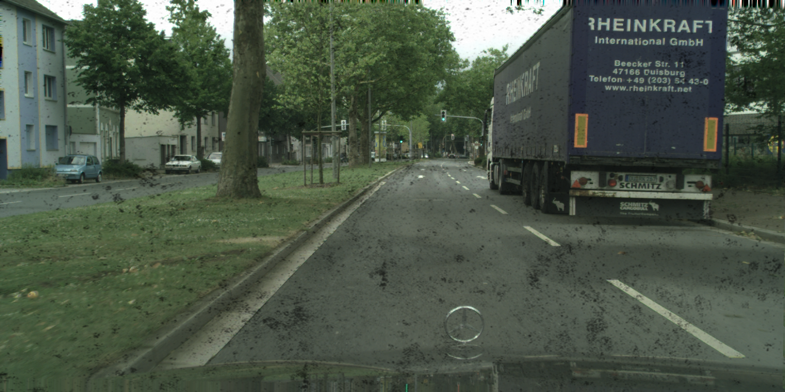
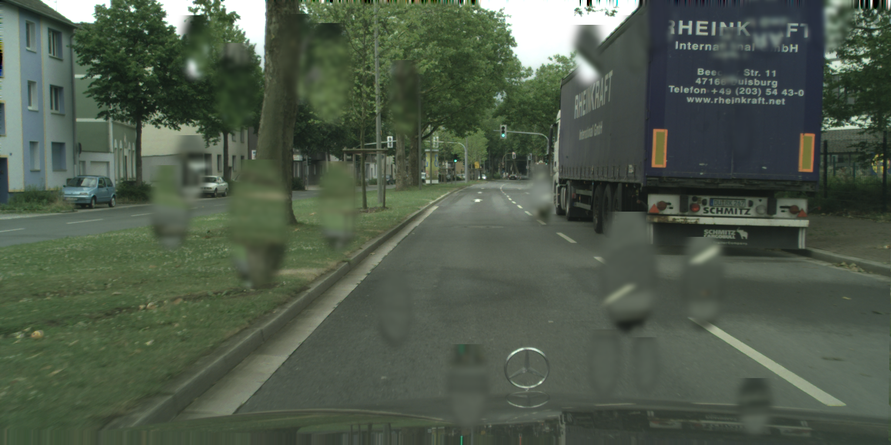
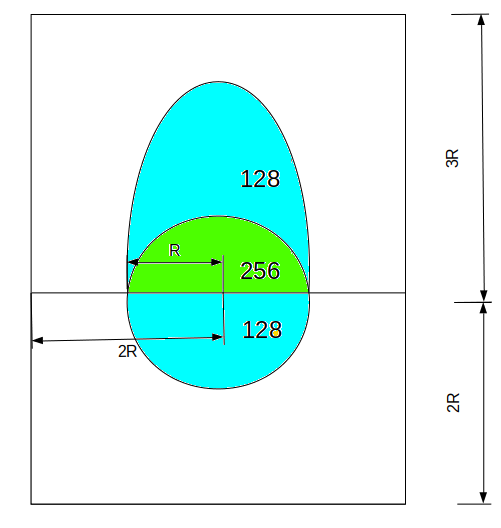
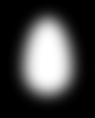

# Filter Generator

This project applies four filters to an input image and outputs results. The application simulates water drops on a lens with various image processing effects.

## Installation

1. **Clone the repository**
   ```bash
   git clone <your-repo-url>
   cd <your-project-folder>
   ```

2. **Create a virtual environment** (optional but recommended)
   ```bash
   python -m venv venv
   # On Windows:
   venv\Scripts\activate
   # On macOS/Linux:
   source venv/bin/activate
   ```

3. **Install dependencies**
   ```bash
   pip install -r requirements.txt
   ```

## Environment Requirements

- **Minimum:** Python 3.9 (required by PyTorch)

### Key packages (in requirements.txt):
- opencv-python
- Pillow
- pyblur
- numpy
- torch
- requests
- timm

---

## Introduction

This repository simulates water drops, dirt, fingerprints and scratch on a lens.





---


## Filters

### 1. Raindrop Filter
Simulates water drops on lens surface with realistic collision detection, edge enhancement, and blending effects.

### 2. Dirt Filter  
Applies dirt texture overlay by darkening image areas. Labels pixels as dirt when mask value > 40/255 (set to 255), otherwise 0.

### 3. Fingerprint Filter
Generates realistic fingerprint smudges with ridge patterns, varying sizes (small/medium/large), and natural oval fingertip shapes with random positioning.

### 4. Scratch Filter
Creates random linear scratches across the image with configurable length, width, and brightness. Applies Gaussian blur for realistic appearance.

---

## Usage

### Raindrops

## Drop Generation

Each drop is composed from simple primitives (circle + oval), rasterized at 128 intensity, then blurred to create a realistic droplet surface effect.




---

## Collision Detection

When a new drop's center overlaps an existing drop center, they are merged; otherwise they remain separate. Edge darkening can be applied to emphasize drop shapes.

**Before Collision:**


**After Collision:**


---

## Edge Enhancement

Optional background darkening to enhance drop rim effects. Parameters are fully configurable.

---

```python
from raindrop.dropgenerator import generateDrops

# Basic usage - returns a Pillow image
output_image = generateDrops(image_path, cfg)

# With label output
output_image, label = generateDrops(image_path, cfg)
```

### Dirt Filter
```python
from dirt import add_dirt_overlay

# Basic usage with default settings
degraded_image, dirt_mask = add_dirt_overlay(image_path)

# Custom dirt texture and parameters
degraded_image, dirt_mask = add_dirt_overlay(
    image_path, 
    dirt_texture_path="path/to/dirt_texture.png",
    dirt_strength=0.6,
    threshold=40
)
```

### Fingerprint Filter
```python
from fingerprints import add_fingerprint_smudge

# Basic usage with random number of fingerprints
smudged_image, fingerprint_mask = add_fingerprint_smudge(image_path)

# Specify number of fingerprint smudges (2-3 recommended)
smudged_image, fingerprint_mask = add_fingerprint_smudge(image_path, num_prints=3)
```

### Scratch Filter
```python
from scratch import add_scratch_overlay

# Basic usage with default settings
scratched_image, scratch_mask = add_scratch_overlay(image_path)

# Custom scratch parameters
scratched_image, scratch_mask = add_scratch_overlay(
    image_path,
    num_scratches=8,
    min_len=0.3,      # Minimum length as fraction of image size
    max_len=0.8,      # Maximum length as fraction of image size
    min_width=1,      # Minimum scratch width in pixels
    max_width=3       # Maximum scratch width in pixels
)
```

See `example.py` for a complete usage example.

---


